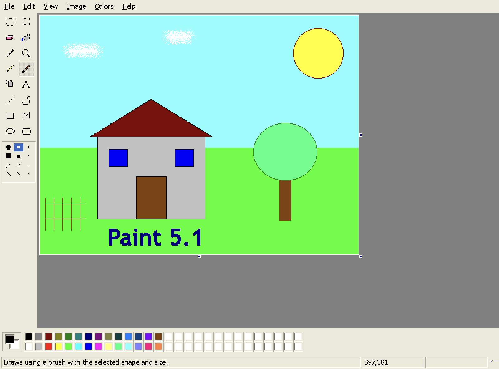
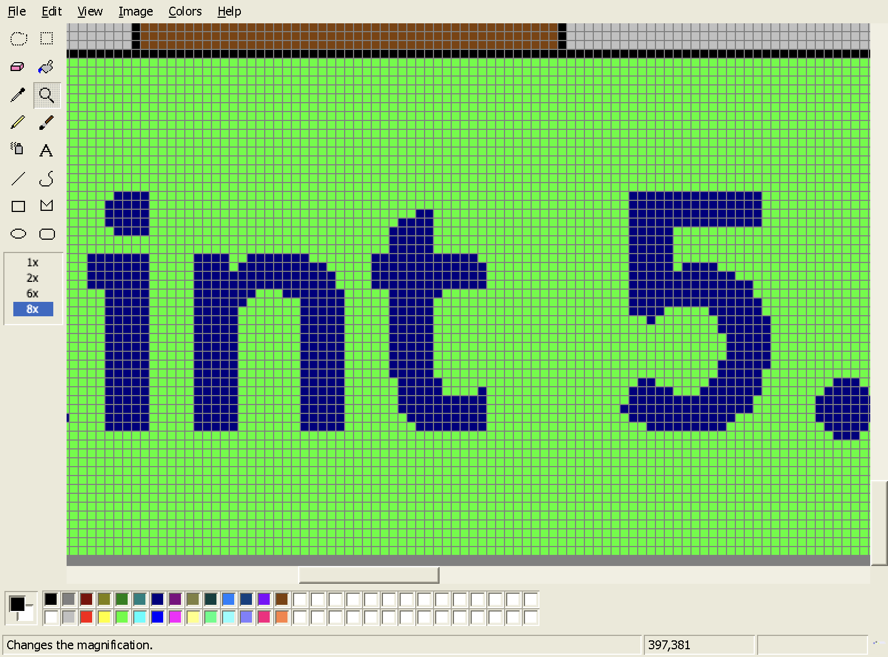
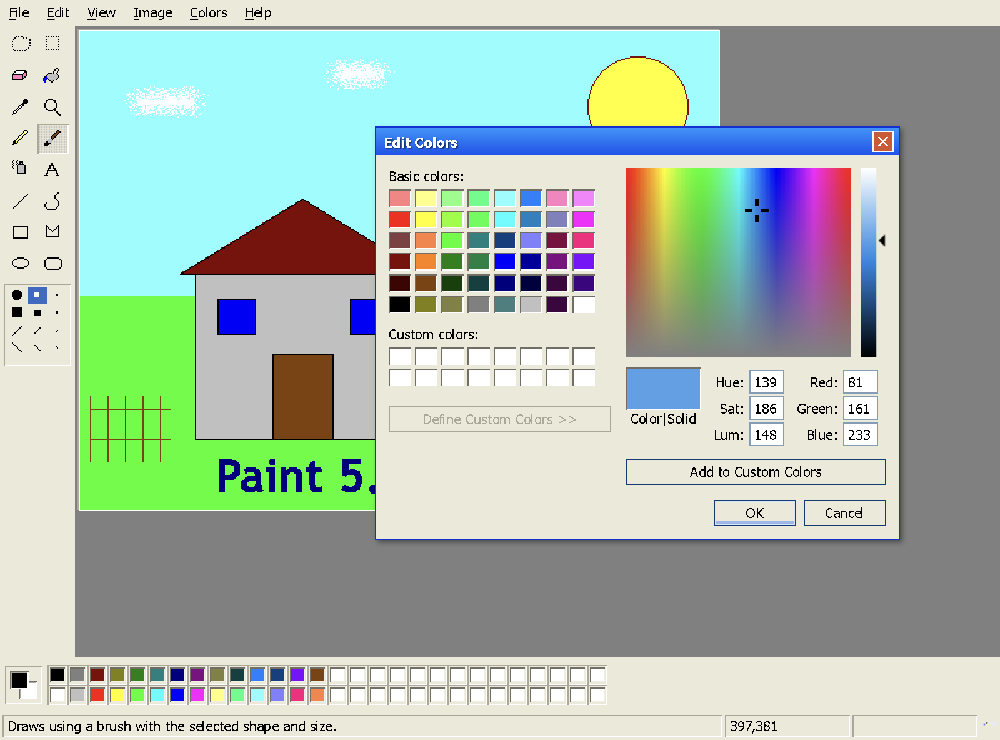

<div align="center">

# Paint 5.1

**Microsoft Paint, as it shipped in Windows XP — rebuilt from scratch, running natively on macOS and Windows.**

Not a theme. Not a tribute. A reimplementation that reproduces the original's
behavior, its limitations, and its quirks — down to the three-level undo.



</div>

---

## The premise

Most "retro Paint" projects recreate the *look*. This one targets the *behavior*.

The rule applied throughout: **where classic Paint was limited, awkward, or unpolished,
that behavior is reproduced.** Undo really does stop at three. Enlarging the canvas
really does fill with white while moving a selection leaves the background color behind
— two inconsistent behaviors that were both in the original. Converting to black and
white really is irreversible.

Everything is drawn into a raw `Uint8ClampedArray` at the image's exact pixel
dimensions by hand-written rasterizers. There is no `ctx.stroke()`, no `ctx.arc()`, no
`lineTo()` anywhere in the drawing path — those are antialiased, and antialiasing is the
one thing Paint never did. Every pixel written is fully opaque or untouched.

Everything below that isn't identical to XP is listed, with the reason, in
[Fidelity](#fidelity). Nothing is glossed over.

<table>
<tr>
<td width="50%"></td>
<td width="50%"></td>
</tr>
<tr>
<td><em>Committed text at 8× with the grid on — every pixel is solid or untouched, no gray fringing.</em></td>
<td><em>The Edit Colors dialog, including the "Define Custom Colors" expansion.</em></td>
</tr>
</table>

---

## Quick start

**The only prerequisite is Node.js.** No Xcode, no Command Line Tools, no Swift, no
Visual Studio, no native compilation, no `node-gyp`. Every dependency (`esbuild`,
`electron`, `electron-builder`, `typescript`) is a prebuilt binary or pure JavaScript.

Install Node 18+ from the [official installer](https://nodejs.org/en/download), then:

```bash
npm install
```

### Try it in a browser

```bash
npm run dev
```

Open **http://localhost:5173/index.html**. The renderer feature-detects the Electron
bridge; with none present it falls back to `<input type="file">` for opening, download
links for saving, and the async Clipboard API for cut/copy/paste. The whole editor
works this way — it is not a degraded preview.

### Run it as a desktop app

```bash
npm run start
```

A real window with native Open/Save panels and the system clipboard. On macOS it gets a
Dock icon and a native application menu whose ⌘-accelerators mirror the in-window menu
bar. On Windows there is deliberately **no** native menu bar — the in-window one *is*
the menu, exactly as it was in XP — and the renderer handles the `Ctrl` accelerators
itself.

### Package it

```bash
npm run dist:mac     # → dist_electron/mac-arm64/Paint.app
npm run dist:win     # → Paint-Setup-5.1.0.exe + Paint-5.1.0-win.zip
npm run dist:all     # both
```

`npm run dist` is an alias for `dist:mac`.

**Both targets build from either host.** Windows artifacts cross-compile from macOS
without installing anything: electron-builder downloads its own NSIS and Wine toolchain
into its cache on first run, so the Node-only requirement still holds. The first
Windows build pulls ~150 MB and takes a minute; subsequent builds are fast.

| Artifact | What it is |
|---|---|
| `Paint-Setup-5.1.0.exe` | NSIS installer, per-user, with a choosable install directory |
| `Paint-5.1.0-win.zip` | Portable — unzip and run `Paint.exe`, no installation |
| `win-unpacked/Paint.exe` | The raw unpacked build |
| `mac-arm64/Paint.app` | The macOS app bundle |

Everything is **unsigned by design**, so both operating systems will warn on first
launch:

- **macOS** — right-click → **Open** → **Open**, or
  `xattr -dr com.apple.quarantine "dist_electron/mac-arm64/Paint.app"`
- **Windows** — SmartScreen shows "Windows protected your PC"; click **More info** →
  **Run anyway**

To build for 32-bit Windows or ARM64, add the arch to the `win.target` entry in
`package.json`; x64 is the default.

---

## What's in it

**All 16 tools**, in the original 2×8 layout: Free-Form Select, Select, Eraser/Color
Eraser, Fill With Color, Pick Color, Magnifier, Pencil, Brush, Airbrush, Text, Line,
Curve, Rectangle, Polygon, Ellipse, Rounded Rectangle — each with its correct options
pane (12 brush shapes, 4 eraser sizes, 5 line widths, 3 fill styles, and so on).

**The full menu structure**: File, Edit, View, Image, Colors, Help — including
Flip/Rotate, Stretch/Skew, Invert Colors, Attributes, Draw Opaque, View Bitmap, Show
Grid, Show Thumbnail, Copy To / Paste From, and recent files. Every dialog is
DOM-rendered in the classic Windows style; the only native dialogs are the file panels.

**File formats**: BMP at 1/4/8/24-bit, GIF, JPEG, PNG. The BMP codec is hand-rolled
with `DataView` — genuine `BITMAPFILEHEADER` + `BITMAPINFOHEADER`, generated palettes,
bottom-up row order, 4-byte row padding, and RLE4/RLE8 decoding. It is not delegated to
a library or to `canvas.toDataURL`. GIF is a pure-JS LZW codec with a median-cut
quantizer.

**Input semantics**: left button draws with the foreground color and right button with
the background color, for every tool, with the context menu suppressed everywhere.
Control-click and two-finger trackpad click count as right button. Shift constrains
lines to 45°, rectangles to squares, ellipses to circles. Option-drag copies a
selection; Shift-drag smears it.

---

## How it renders

Five rules that the whole design follows:

1. **One source of truth.** The document is an `ImageData` buffer at exact pixel size.
   The visible canvas is only a display surface — it is blitted from the buffer and
   never drawn into by tools.
2. **No antialiasing, anywhere.** `imageSmoothingEnabled = false` on every context,
   `image-rendering: pixelated` in CSS, and hand-written Bresenham / midpoint-ellipse /
   scanline-polygon rasterizers that write directly into the typed array.
3. **Alpha is not a user-facing concept.** "Transparent" selection and text modes are
   color-key masking against the current background color, not alpha blending.
   Imported images are flattened to fully opaque on load.
4. **Integer nearest-neighbor zoom.** The display canvas is sized in device pixels and
   laid out in CSS points, so 8× is crisp on Retina rather than a blurry upscale.
5. **Text is thresholded.** Canvas text is unavoidably antialiased, so glyphs are
   rendered to a scratch canvas and the alpha channel is thresholded (α ≥ 128 → solid
   color, else untouched) before compositing. Hard edges only.

Shape previews during a drag are **real pixels** written into the buffer and restored
from a stroke snapshot between frames — the same approach Paint used, not a separate
preview layer. That snapshot doubles as the undo record when the stroke ends.

---

## Fidelity

### Deliberately preserved quirks

These are **not** bugs. They are listed so they are not mistaken for bugs.

| Behavior | Detail |
|---|---|
| **Undo is exactly 3 levels** | `UNDO_DEPTH` in `src/core/history.ts` is a single constant, and it ships at `3`. |
| **Enlarging the canvas fills white** | …while *moving a selection* leaves the **background color** behind. Both inconsistent behaviors are original. |
| **Black and white is irreversible** | `Image ▸ Attributes ▸ Black and white` warns, dithers to 1-bit, and clears the undo history. |
| **Zoom is not remembered** | New/Open resets to 100% and turns the grid off. |
| **Pick Color reverts** | It samples one pixel, then switches back to the previously selected tool. |
| **Oversized paste prompts** | *"The image in the clipboard is larger than the bitmap. Would you like the bitmap enlarged?"* |
| **Depth loss warns** | Saving into a lower color depth asks for confirmation first. |
| **The Airbrush keeps spraying** | It sprays on a ~10 Hz timer while the button is held, even with the pointer stationary. |
| **Nothing modern** | No layers, no alpha, no antialiasing, no brush opacity or softness, no aspect-ratio lock, no shape gallery, no Ribbon. |

### Where it deviates, and why

Every deviation is forced by the platform, by the asset policy, or by the absence of a
Win32 API — none is a matter of taste.

<details>
<summary><b>On macOS the window frame is native; the client area is always Windows</b></summary>

On macOS the title bar, traffic lights, and window management use the standard system
frame (`titleBarStyle: 'default'`). Reproducing the Luna title bar would have required a
frameless window plus a hand-built drag/resize/zoom implementation, breaking Mission
Control, Spaces, and window snapping. macOS conventions apply only at the OS boundary —
everything inside the client area is classic Windows chrome drawn in DOM/CSS.

On Windows this deviation mostly disappears: you get a native Windows frame around
Windows chrome. Electron's own menu bar is suppressed there so the in-window menu bar is
the only one, which is how XP actually looked — on macOS the native menu is additionally
registered so ⌘-shortcuts work at the OS level.
</details>

<details>
<summary><b>Fonts are metric-compatible substitutes, not Microsoft's</b></summary>

Tahoma is not redistributable and is not bundled. The UI font stack is
`Tahoma, "DejaVu Sans", Geneva, Verdana, sans-serif` at 11px — Tahoma is used if the
user happens to have it, otherwise a metrically similar fallback.
`-webkit-font-smoothing: none` is set but macOS honors it inconsistently, so UI *chrome*
text may be slightly smoother than XP's. This does **not** affect the canvas: committed
text goes through the alpha threshold and is guaranteed hard-edged.
</details>

<details>
<summary><b>All artwork is recreated from scratch</b></summary>

Every tool icon, cursor, and dialog icon is hand-authored pixel art defined as ASCII
sprite maps in `src/ui/icons.ts` and rendered to canvases at runtime. Nothing is
extracted from `mspaint.exe`, `shell32.dll`, or any Microsoft resource. They are
visually faithful recreations, not copies, so individual pixels differ from the
originals.
</details>

<details>
<summary><b>Text uses the platform's glyph rasterizer, then thresholds it</b></summary>

Glyph *shapes* come from macOS's rasterizer, so they are not pixel-identical to GDI's
output at the same nominal size — but the threshold guarantees there is no gray
fringing. Font sizes are converted pt → px at 96 dpi to match Windows' logical DPI.

While a text frame is open it is a `contenteditable` overlay scaled to the zoom level,
so it is antialiased *during editing*. That is only ever a preview; the committed pixels
go through the threshold path. This matches Paint's model — text stays editable until
the frame is dismissed, then becomes unmodifiable pixels.
</details>

<details>
<summary><b>BMP depth selection in the packaged app follows the document</b></summary>

XP's Save As dialog listed *Monochrome / 16 Color / 256 Color / 24-bit Bitmap* as four
entries in one dropdown. macOS's save panel filters by file *extension*, and all four
are `.bmp`, so it cannot offer that choice. The packaged app writes BMPs at the depth
the document is already using (from the file that was opened, or from
`Image ▸ Attributes`), defaulting to 24-bit. The browser build's in-window Save As
dialog exposes all four explicitly. The encoder supports 1/4/8/24-bit in both builds.
</details>

<details>
<summary><b>Save As in the browser build uses an in-window dialog</b></summary>

Browsers cannot show a save panel. The Electron build uses the real native panel, with
the format taken from the chosen extension. The browser build falls back to a
classic-styled in-window dialog with a file-name field and a "Save as type" dropdown,
then triggers a download. The packaged app never shows it.
</details>

<details>
<summary><b>Printing goes through Electron; two menu items are stubs</b></summary>

`File ▸ Print` renders the bitmap into a temporary HTML page at 96 dpi and calls
`webContents.print()`, raising the standard macOS print panel. Page Setup and Print
Preview are in-window classic dialogs feeding paper size, orientation, and margins into
that path. In the browser build, printing opens a new window and calls `window.print()`.

`Set As Desktop Background` has no appropriate equivalent to call, and writing to the
user's desktop configuration unprompted isn't something this app should do — both menu
items show an explanatory message box. `Help ▸ Help Topics` originally opened
`mspaint.chm`; there is no CHM to ship, so it also shows a message box.
</details>

<details>
<summary><b>On macOS, Paint's shortcuts win over system conventions inside the window</b></summary>

Every Windows `Ctrl` accelerator is mapped to `Cmd`, so a few combinations do not do
what a Mac user expects: **`Cmd+W` is Stretch/Skew**, not Close Window, and `Cmd+E` is
Attributes. Paint's behavior wins inside the window; macOS conventions apply only at the
OS boundary. The window still closes from the red traffic light, `Cmd+Q`, or
`File ▸ Exit`, each of which runs the "Save changes?" prompt. The original `Ctrl`
combinations also still work.

On Windows there is no conflict at all — `Ctrl+W` is Stretch/Skew there just as it was
in XP, and every accelerator matches the original exactly.
</details>

<details>
<summary><b>Two small additions, and one thing that looks like a bug</b></summary>

**Crop to selection** does not exist in XP Paint's menus — it arrived with the Windows 7
Ribbon. It is implemented but deliberately kept **out of every menu**, bound to
`Ctrl/Cmd + Shift + X` only, so the menu structure stays exactly as XP shipped it.

**Recent files** are stored in `localStorage` (4 entries, as in the original) rather
than the registry. The list is empty on first run with a disabled placeholder, matching
XP.

**`Show Grid` is disabled below 400%** — that is the original's behavior, not a bug. It
is easy to mistake for one when zoomed out.
</details>

<details>
<summary><b>Known differences in rasterizer output</b></summary>

The rasterizers are reimplementations of GDI's behavior, not ports of GDI. They produce
hard, deterministic pixels, but:

- **Ellipses** use Zingl's rect-bounded midpoint algorithm — symmetric in both axes and
  exact for even/odd extents, matching `Ellipse()` closely, though individual boundary
  pixels on some radii may differ by one.
- **Thick lines and shape outlines** stamp a round pen along the path, which is what GDI
  does for a `PS_SOLID` geometric pen. Joins on very thick polygon corners may differ
  slightly.
- **Rounded rectangle** corner radius is fixed at up to 8px and clamped for small
  rectangles, approximating `RoundRect` with Paint's fixed ellipse size.
</details>

---

## Tests

The engine has a self-test harness that drives the real rasterizers, tools, and codecs
in a real DOM and asserts pixel-level behavior — 55 checks covering Bresenham
staircases with zero gray pixels, flood-fill containment against a 1px diagonal, BMP
header and row-order correctness, undo depth, selection semantics, text thresholding,
and the invariant that no partial-alpha pixel ever reaches the buffer.

```bash
npm run typecheck                 # tsc --noEmit
npm run dev                       # then open /tests/selftest.html
```

Results also land on `window.SELFTEST` and in the console.

To write sample images with the app's own encoders and confirm other applications can
read them:

```bash
npm run samples
open /tmp/paint-samples           # inspect in Preview, Finder, etc.
```

All four BMP depths and the GIF are verified to decode correctly through macOS's own
ImageIO, at the right dimensions and orientation.

---

## Project layout

| Path | Purpose |
|---|---|
| `index.html`, `styles.css` | Chrome skeleton and the XP Luna visual style |
| `src/app.ts` | Wiring: owns the document, implements `ToolContext`, dispatches menu commands |
| `src/core/pixelbuffer.ts` | The document's source of truth — an RGBA buffer at exact pixel size |
| `src/core/raster.ts` | Bresenham, midpoint ellipse, polygon, transforms |
| `src/core/flood.ts` | Iterative scanline flood fill — fills 5000×5000 without recursion |
| `src/core/history.ts` | Undo stack, `UNDO_DEPTH = 3` |
| `src/tools/` | The 16 tools behind one `Tool` interface |
| `src/ui/` | Tool box, options pane, color box, status bar, menus, dialogs, canvas view |
| `src/io/bmp.ts` | Hand-rolled BMP reader/writer (1/4/8/24-bit, `DataView`) |
| `src/io/gif.ts` | Pure-JS GIF codec (LZW + median-cut quantizer) |
| `electron/` | Main process and preload — window, native panels, clipboard, menu, print |
| `tests/` | Self-test harness and sample-file generator |

Built with esbuild. No UI framework — the chrome is small, static, and pixel-positioned,
where a virtual DOM buys nothing and gets in the way of exact layout.

---

## Legal

Not affiliated with, endorsed by, or derived from Microsoft. No Microsoft binaries,
icon resources, or fonts are extracted, embedded, or redistributed — every icon, cursor,
and palette is recreated from scratch as original pixel art. "Microsoft Paint" and
"Windows XP" are trademarks of Microsoft Corporation, used here only to describe what
this project reproduces.
